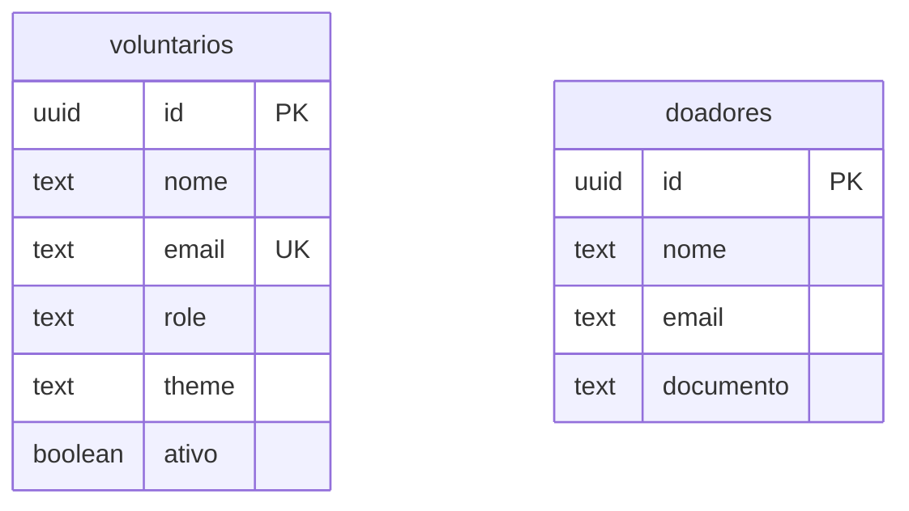
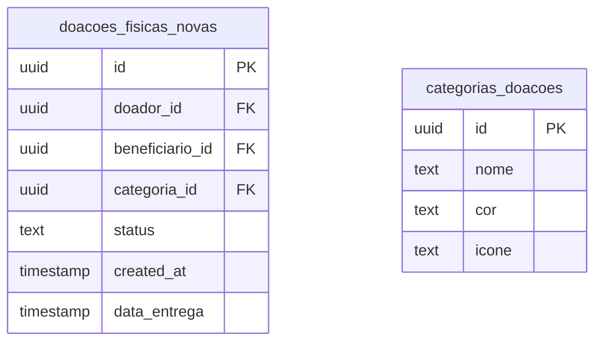
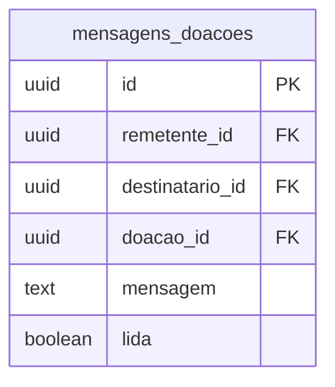
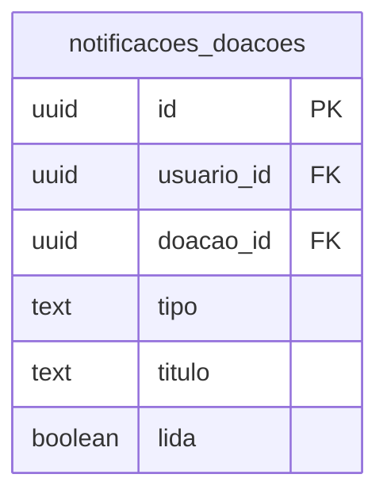

# Apresentação Técnica - DER Sistema Viver Solidário

## 1. Introdução Técnica
- **Sistema**: Plataforma de gestão de doações e voluntariado
- **Arquitetura**: Progressive Web App (PWA) com Supabase
- **Banco de Dados**: PostgreSQL com Row Level Security (RLS)
- **Framework**: React + TypeScript + Tailwind CSS

---

## 2. Arquitetura do Banco de Dados

### 2.1 Esquemas Principais
```sql
-- Esquema público para dados da aplicação
public.voluntarios
public.doacoes_fisicas_novas
public.categorias_doacoes
public.doadores
```

### 2.2 Estratégia de Identificação
- **UUIDs**: Todos os IDs primários utilizam `uuid` com `gen_random_uuid()`
- **Vantagens**: Distribuição, segurança, unicidade global
- **Performance**: Indexação otimizada para consultas

---

## 3. Entidades Principais e Relacionamentos

### 3.1 Gestão de Usuários


**Aspectos Técnicos:**
- Separação clara entre perfis de voluntários e doadores
- Suporte a múltiplos roles: `donor`, `volunteer`, `internal`, `admin`
- Integração com Supabase Auth via triggers

### 3.2 Sistema de Doações Físicas (Core)


**Máquina de Estados:**
```
disponivel → aceita → recebida
    ↓
cancelada (em qualquer estado)
```

---

## 4. Características Técnicas Avançadas

### 4.1 Row Level Security (RLS)
```sql
-- Exemplo de política RLS
CREATE POLICY "Usuários podem ver seu próprio perfil" 
  ON public.voluntarios 
  FOR SELECT 
  TO authenticated 
  USING (id = auth.uid());
```

**Benefícios:**
- Segurança a nível de linha
- Isolamento automático de dados
- Performance otimizada

### 4.2 Triggers e Funções
```sql
-- Função para verificar permissões admin
CREATE OR REPLACE FUNCTION public.is_admin(user_id uuid)
RETURNS boolean AS $$
  SELECT EXISTS (
    SELECT 1 FROM voluntarios 
    WHERE id = user_id AND role IN ('admin', 'internal')
  );
$$ LANGUAGE SQL SECURITY DEFINER;
```

### 4.3 Auditoria e Logs
```sql
-- Tabela de ações administrativas
admin_actions {
    uuid id PK
    uuid admin_id FK
    text action_type
    text target_type
    jsonb metadata
    timestamp created_at
}
```

---

## 5. Sistema de Comunicação

### 5.1 Mensagens entre Usuários


### 5.2 Notificações do Sistema


---

## 6. Aspectos de Performance

### 6.1 Indexação Estratégica
```sql
-- Índices principais
CREATE INDEX idx_doacoes_status ON doacoes_fisicas_novas(status);
CREATE INDEX idx_doacoes_doador ON doacoes_fisicas_novas(doador_id);
CREATE INDEX idx_doacoes_categoria ON doacoes_fisicas_novas(categoria_id);
```

### 6.2 Paginação e Filtros
- Implementação de `LIMIT` e `OFFSET` para grandes datasets
- Filtros por status, categoria e doador
- Cache inteligente via React Query

---

## 7. Segurança e Compliance

### 7.1 Autenticação
- **Supabase Auth**: JWT tokens, refresh tokens automáticos
- **Multi-factor**: Suporte a MFA opcional
- **OAuth**: Integração com provedores sociais

### 7.2 Autorização Granular
```sql
-- Políticas específicas por role
CREATE POLICY "Admins podem ver todos os perfis" 
  ON public.voluntarios 
  FOR SELECT 
  TO authenticated 
  USING (public.is_admin(auth.uid()));
```

### 7.3 Proteção de Dados
- **Criptografia**: TLS/SSL em todas as conexões
- **LGPD**: Campos para consentimento e exclusão
- **Backup**: Snapshots automáticos diários

---

## 8. Escalabilidade e Manutenção

### 8.1 Migrations Versionadas
```sql
-- Controle de versão das mudanças
-- supabase/migrations/20250617144636-*.sql
```

### 8.2 Monitoramento
- **Logs**: PostgreSQL logs + Application logs
- **Métricas**: Performance queries, conexões ativas
- **Alertas**: Thresholds automáticos

### 8.3 Backup e Recovery
- **Point-in-time Recovery**: 7 dias de retenção
- **Replicação**: Read replicas para consultas pesadas
- **Disaster Recovery**: Backup cross-region

---

## 9. Tecnologias Utilizadas

### 9.1 Stack Principal
- **Frontend**: React 18 + TypeScript + Vite
- **Backend**: Supabase (PostgreSQL + Edge Functions)
- **Auth**: Supabase Auth
- **UI**: Shadcn/ui + Tailwind CSS
- **State**: TanStack Query + Context API

### 9.2 Ferramentas de Desenvolvimento
- **ORM**: Supabase Client (tipo-safe)
- **Validação**: Zod schemas
- **Testing**: Implementação futura
- **CI/CD**: Deploy automático via Lovable

---

## 10. Métricas e KPIs Técnicos

### 10.1 Performance
- **Query Response Time**: < 200ms (P95)
- **Page Load Time**: < 3s (LCP)
- **Database Connections**: Pool de 20 conexões

### 10.2 Disponibilidade
- **Uptime Target**: 99.9%
- **RTO**: 4 horas
- **RPO**: 1 hora

---

## 11. Roadmap Técnico

### 11.1 Próximas Implementações
- [ ] Sistema de cache Redis
- [ ] Implementação de testes automatizados
- [ ] Otimização de queries complexas
- [ ] Sistema de relatórios avançados

### 11.2 Melhorias de Arquitetura
- [ ] Implementação de Event Sourcing
- [ ] Microserviços para módulos específicos
- [ ] Implementação de CQRS para leitura/escrita

---

## 12. Considerações de Compliance

### 12.1 LGPD
- Campos de consentimento nas tabelas de usuários
- Funcionalidade de exclusão completa de dados
- Logs de acesso e modificações

### 12.2 Auditoria
- Todas as ações administrativas são logadas
- Trilha de auditoria completa para doações
- Backup de logs por 2 anos

---

## Conclusão

O DER do Sistema Viver Solidário foi projetado com foco em:
- **Escalabilidade**: Suporte a milhares de usuários simultâneos
- **Segurança**: RLS e autenticação robusta
- **Manutenibilidade**: Código limpo e bem documentado
- **Performance**: Índices otimizados e queries eficientes

A arquitetura permite crescimento orgânico e adição de novos módulos sem impacto nas funcionalidades existentes.
