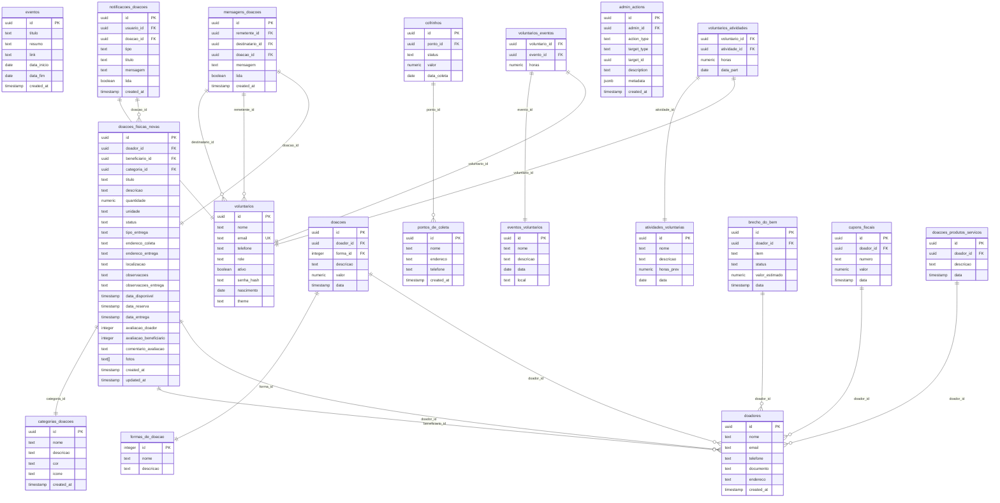

# Diagrama de Entidade-Relacionamento (DER) - Viver Solidário

## Diagrama Principal do Banco de Dados

## Entidades Principais e Suas Funções

### 1. Gestão de Usuários
- **voluntarios**: Usuários do sistema (doadores, voluntários, administradores)
- **doadores**: Perfil específico de doadores com informações adicionais

### 2. Sistema de Doações
- **doacoes_fisicas_novas**: Doações de itens físicos (principal módulo)
- **categorias_doacoes**: Classificação das doações físicas
- **doacoes**: Doações financeiras
- **formas_de_doacao**: Métodos de pagamento (PIX, PayPal, etc.)

### 3. Sistema de Voluntariado
- **atividades_voluntarias**: Atividades disponíveis para voluntários
- **voluntarios_atividades**: Relacionamento voluntário-atividade
- **eventos_voluntarios**: Eventos específicos de voluntariado
- **voluntarios_eventos**: Participação em eventos

### 4. Sistema de Comunicação
- **mensagens_doacoes**: Comunicação entre usuários sobre doações
- **notificacoes_doacoes**: Notificações do sistema

### 5. Gestão Administrativa
- **admin_actions**: Log de ações administrativas
- **eventos**: Eventos e campanhas da ONG
- **pontos_de_coleta**: Locais para coleta de doações

### 6. Módulos Específicos
- **brecho_do_bem**: Doações para o brechó da ONG
- **cofrinhos**: Gestão de cofrinhos de coleta
- **cupons_fiscais**: Controle de cupons fiscais
- **doacoes_produtos_servicos**: Doações de produtos e serviços

## Relacionamentos Importantes

1. **Um doador pode fazer múltiplas doações** (físicas e financeiras)
2. **Uma doação física pode ter um beneficiário** (quem recebe)
3. **Voluntários podem participar de múltiplas atividades e eventos**
4. **Doações físicas podem gerar mensagens** entre doador e beneficiário
5. **Sistema de notificações** vinculado às doações
6. **Logs administrativos** para auditoria de ações

## Status e Fluxos

### Status de Doações Físicas:
- `disponivel` → `reservada` → `entregue`
- Possibilidade de `cancelada` em qualquer etapa

### Tipos de Usuários (role):
- `donor`: Doador comum
- `volunteer`: Voluntário
- `internal`: Funcionário interno
- `admin`: Administrador completo

Este diagrama representa a estrutura completa do banco de dados do sistema Viver Solidário, mostrando todas as entidades e seus relacionamentos.
