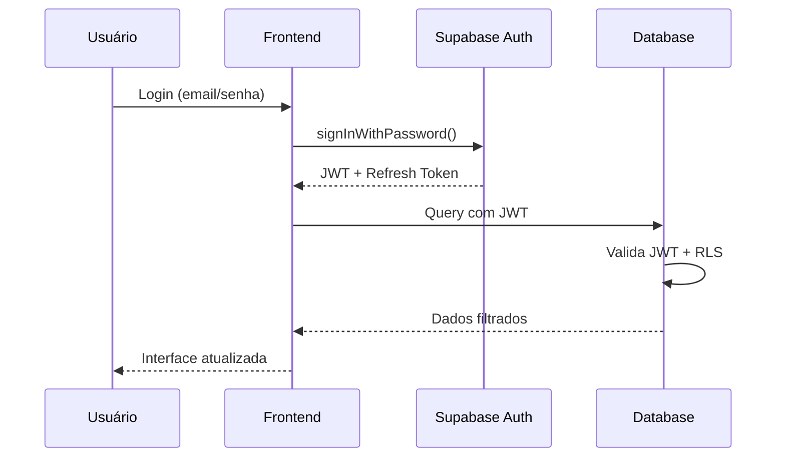
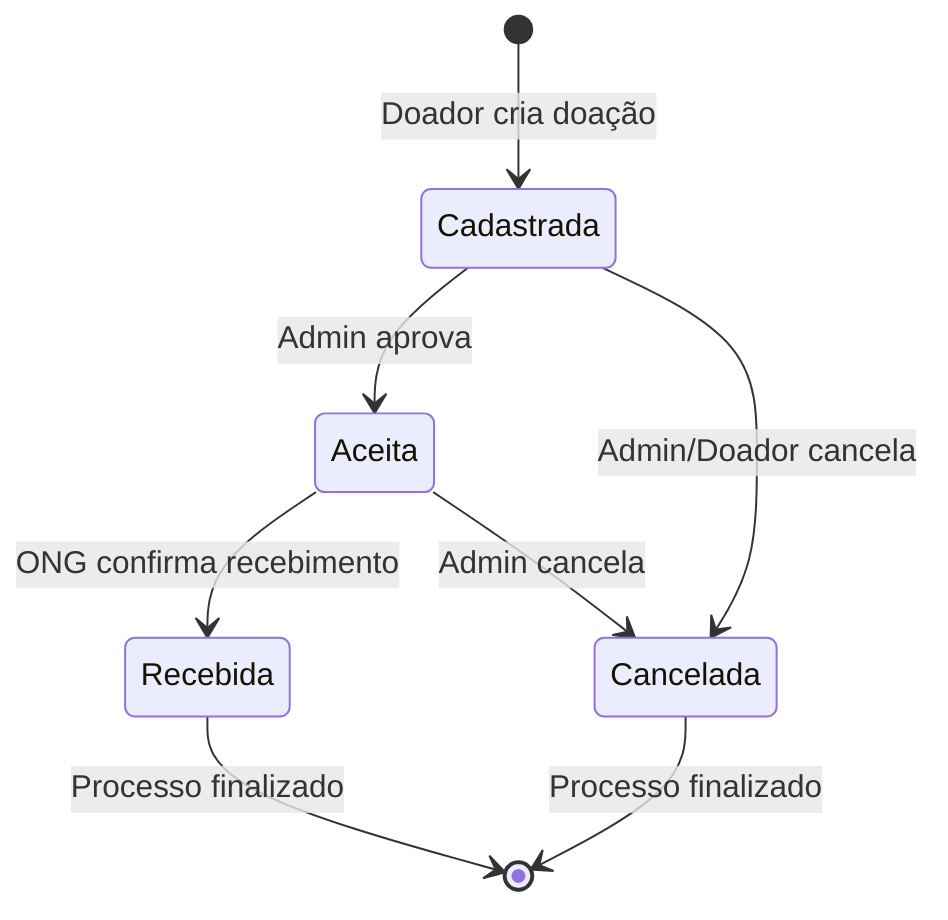
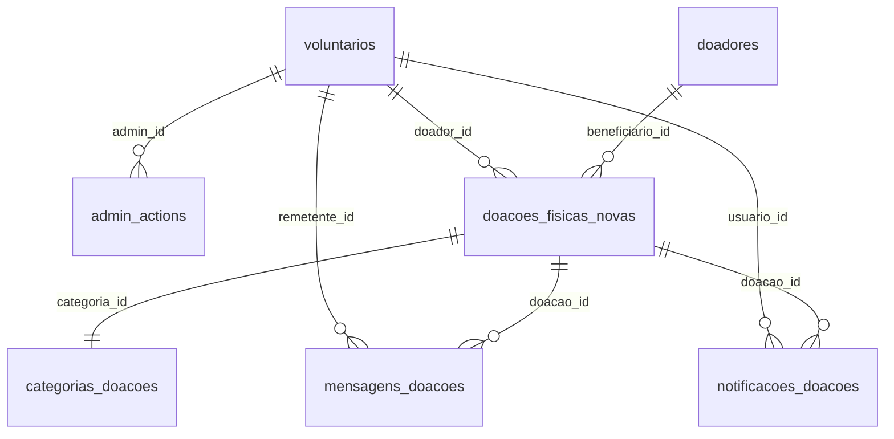
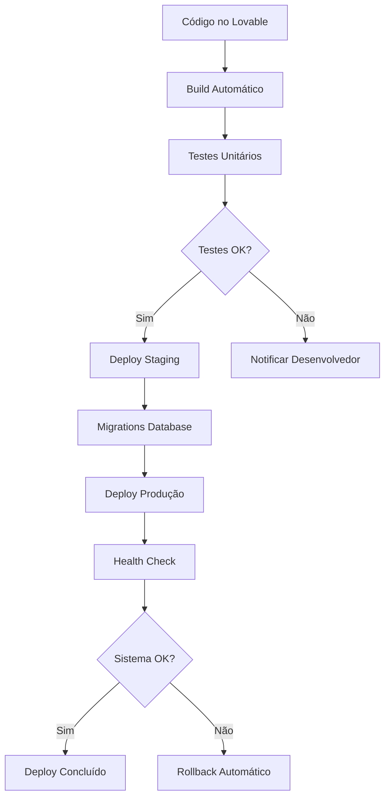

# Diagramas Técnicos Complementares

## 1. Fluxo de Autenticação


## 2. Fluxo de Doação


## 3. Arquitetura de Dados


## 4. Pipeline de Deployment


## 5. Estrutura de Permissões
```mermaid
graph TD
    A[Usuário Autenticado] --> B{Verificar Role}
    B -->|donor| C[Ver próprias doações]
    B -->|volunteer| D[Participar eventos]
    B -->|internal| E[Gerenciar doações]
    B -->|admin| F[Acesso total]
    
    C --> G[RLS Policy: doador_id = auth.uid()]
    D --> H[RLS Policy: participar eventos]
    E --> I[RLS Policy: is_admin() OR is_internal()]
    F --> J[RLS Policy: is_admin()]
```
